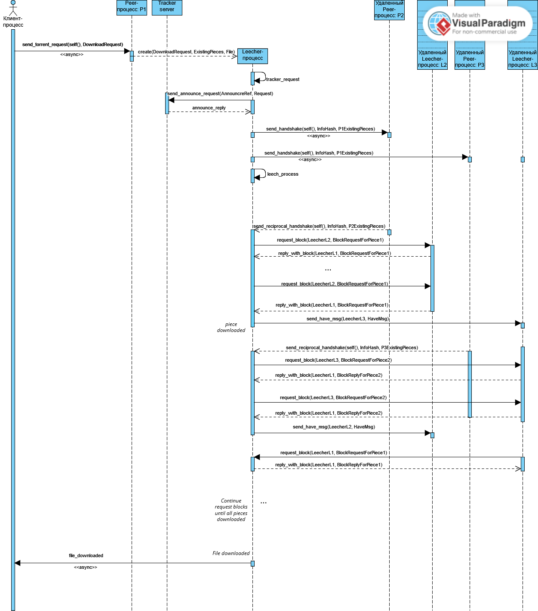

# Bittorrent-like protocol implementation on Erlang nodes
Министерство науки и высшего образования Российской Федерации федеральное государственное автономное образовательное учреждение высшего образования

«Национальный исследовательский университет ИТМО»

---
__ФПИиКТ, Системное и Прикладное Программное Обеспечение__

__Лабораторная работа №3__

по Функциональному программированию

Выполнил: Хузин Р.Р.

Группа: P34112

Преподаватель: Пенской Александр Владимирович

###### Санкт-Петербург
###### 2022 г.
---

## Описание проекта

__Кратко:__

Проект реализует протокол BitTorrent для обмена файлами между узлами, работающими на Erlang. Ключевые особенности проекта:

Модуль peer отвечает за прием запросов от клиентов и создание процессов _leecher для каждого торрента, где осуществляется вся основная работа с файлами.

Все сообщения передаются через распределенную систему Erlang, и каждый узел идентифицируется как {peer, <node_name>}.

При обмене сообщениями пиры обмениваются идентификаторами leecher процессов, так что после handshake они отправляют сообщения друг другу напрямую.

Знакомство с пирами происходит с помощью другой ноды, торрент-трекера, идентификатор которого записан в торрент-файле.

__Sequence диаграмма__



__Описание модулей:__


* Модуль __ep2psharing_app__: Это модуль запускает peer-процесс.

* Модуль __ep2psharing_peer__: Данный модуль предоставляет основной функционал узла-клиента, который принимает запросы от клиента и под каждый торрент спавнит процесс _leecher, где происходит основная работа с данным торрентом.

* Модуль __ep2psharing_leecher__: Данный модуль представляет лич-процессы, которые создаются для каждого торрента. Они осуществляют подключение к другим пирам и загрузку/отдачу блоков.

* Модуль __ep2psharing_tracker_server__: Данный модуль реализует функционал сервера трекера. Он принимает запросы от клиентов, обрабатывает их и отправляет обратно информацию о других пирах.

* Модуль __ep2psharing_read_torrent_file__: Этот модуль отвечает за чтение торрент-файлов и возвращение их содержимого в виде Erlang-структур.

* Модуль __ep2psharing_bencoding__: Этот модуль предоставляет функционал для преобразования данных в формате Bencoding.

* Модуль __ep2psharing_util__: Этот модуль содержит различные вспомогательные функции, которые используются в разных частях проекта.    


                            +-----------------+
                            |   Torrent file  |
                            |     (tracker)   |
                            +-----------------+
                                     |
                                     |
                                     |
                                     v
     +-----------------------------------------------+
     |                   Node 1                      |
     |                 +-------------+               |
     |                 |     Peer    |               |
     |                 +-------------+               |
     | +-------------+ +-------------+ +-------------+ |
     | | (leecher 1) | | (leecher 2) | | (leecher 3) | |
     | +-------------+ +-------------+ +-------------+ |
     +-----------------------------------------------+
                        ^            |
                        |            |
                        |            |
                        |            v
     +-----------------------------------------------+
     |                   Node 2                      |
     |                 +-------------+               |
     |                 |     Peer    |               |
     |                 +-------------+               |
     | +-------------+ +-------------+ +-------------+ |
     | | (leecher 1) | | (leecher 2) | | (leecher 3) | |
     | +-------------+ +-------------+ +-------------+ |
     +-----------------------------------------------+

## Ввод/Вывод программы

__Запуск проекта__

Каждую ноду необходимо запустить с помощью команды erl -name <node_name>@<ip_address>. Например, для запуска двух нод с именами node1 и node2 на локальной машине необходимо выполнить команды:

```
erl -name peer1@127.0.0.1 -pa <path_to_bin_build> <path_to_wpool_bin>
erl -name peer2@127.0.0.1 -pa <path_to_bin_build> <path_to_wpool_bin>
erl -name tracker@127.0.0.1 -pa <path_to_bin_build> <path_to_wpool_bin>
```


__Поднятие торрент трекера__

```
ep2psharing_tracker_sup:start_link().
```

__Поднятие пира и отправление запроса__

```
TorrentFile = ep2psharing_read_torrent_file:
read_torrent_file(<path_to_torrent_file>).
DownloadRequest = DownloadRequest = {download_request, TorrentFile, 
<path_to_target_file>}.
ep2psharing_peer_sup:start_link().
ep2psharing_peer:send_torrent_request(self(), DownloadRequest).
```

__Пример загрузки файла__

Был запущен peer1@127.0.0.1, который в запросе указал готовый файл big.txt, соответственно peer1
ничего не скачивает, а только раздает чанки.

Также был запушен peer2@127.0.0.1, который в запросе указал пустой файл empty1.txt.

После завершения работы сверяем содержимое (исходный файл должен содержать LF
окончания строк):

```
rain@DESKTOP-LPL89HO:/mnt/c/Users/hrami/Desktop/ramil/erlang_p2p_file_sharing/example$ cmp big.txt empty1.txt
rain@DESKTOP-LPL89HO:/mnt/c/Users/hrami/Desktop/ramil/erlang_p2p_file_sharing/example$ diff big.txt empty1.txt
rain@DESKTOP-LPL89HO:/mnt/c/Users/hrami/Desktop/ramil/erlang_p2p_file_sharing/example$ 

```
